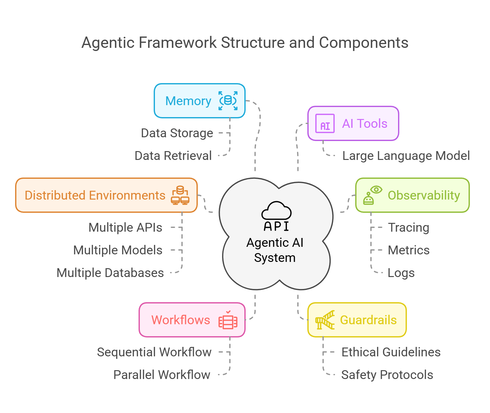
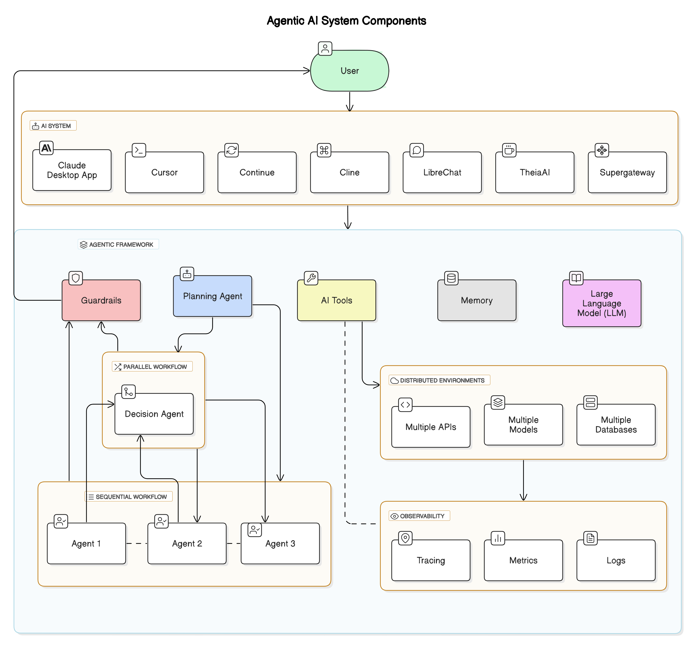
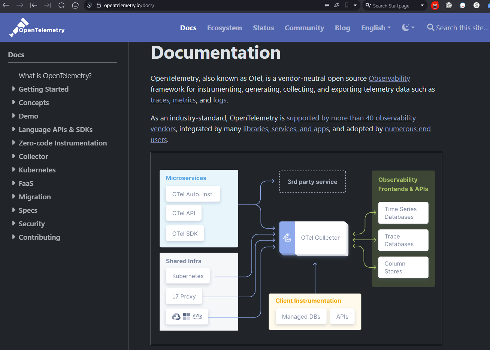

# Observability in Agentic AI Systems: Enabling OpenTelemetry in Agentico SDK

Agentic AI systems thrive in **distributed environments**, where multiple components interact dynamically. These systems orchestrate **AI models, APIs, and data pipelines** across diverse infrastructures - cloud, edge, and airgap environments.

But with this complexity comes a challenge: **How do you monitor and troubleshoot AI-driven workflows in real time?** 

<!-- truncate -->

This is where **OpenTelemetry (OTel)** steps in. By integrating OTel into **Agentico SDK**, AI developers gain **deep visibility** into how their agents interact, execute tasks, and make decisions.

By enabling OTel, you get:

- **Distributed Tracing**: Track AI workflows across multiple services.
- **Metrics Collection**: Monitor agent response times and API calls.
- **Log Correlation**: Identify issues by linking logs to trace spans.
- **Real-Time Insights**: Debug and optimize AI workflows on the fly.

## Unlocking AI Observability: Instrumenting Your Agentic AI Tools with OpenTelemetry

<iframe width="100%"  style={{"aspect-ratio": "16 / 9"}} src="https://www.youtube.com/embed/tAvY7oGhkIU" frameborder="0" allow="accelerometer; autoplay; encrypted-media; gyroscope" referrerpolicy="strict-origin-when-cross-origin" allowfullscreen>
</iframe>

This is a new era, AI systems are complex and distributed, and we need to ensure a high level of transparency and efficiency in AI development! As our systems become increasingly distributed and interconnected, understanding every step of an AI workflow isn't just a luxury - it's a necessity. Let's dive into how OpenTelemetry can help you achieve this level of observability in your AI systems, in this post we will explore how the Agentico SDK and the [Model Context Protocol](https://modelcontextprotocol.io) (MCP) empower you to harness [OpenTelemetry](https://opentelemetry.io/), ensuring your AI tools are not only powerful but also observable and debuggable.

## The Complexity of Distributed AI Systems



Modern AI systems are distributed by nature. They interact with various APIs, databases, and microservices, each potentially hosted in different environments - from local Docker containers to sprawling cloud infrastructures. This complexity introduces challenges like latency issues, data synchronization, and hidden bottlenecks that can slow down performance or, worse, lead to errors that are hard to diagnose.

### The Challenge: Debugging Black-Box AI Workflows

Imagine trying to debug an AI system without any insight into its internal workings. When something goes wrong, you're left guessing which component failed or which microservice caused the delay. That's where observability tools come into play. By instrumenting your AI tools, you can trace the flow of data, monitor performance, and quickly identify problems. This is not just about fixing bugs - it's about optimizing and scaling your systems effectively.

### OpenTelemetry: The Observability Game-Changer

OpenTelemetry (OTel) is an open-source observability framework that provides standardized tools to collect and export traces, metrics, and logs from your applications. When integrated into your AI tools, OTel offers:

* **End-to-End Tracing:** Capture every step in your AI workflow - from data ingestion to model inference.
* **Enhanced Debugging:** Quickly locate performance bottlenecks or failure points.
* **Comprehensive Metrics:** Monitor response times, error rates, and resource utilization.
* **Seamless Integration:** With Agentico SDK, much of the heavy lifting is handled for you. 
  * Focus on building your AI tools, and let Agentico and OTel handle the observability.
  * Give it a try to the Agentico's [`mcp-create-tool`](https://agentico.dev/docs/quickstart/create-a-server/) and see how easy it is to create a new server with OpenTelemetry support.

By embedding OTel in your AI stack, you're not only enhancing your system's reliability but also improving the developer experience (DevEx) with actionable insights and streamlined debugging.

## Why Observability Matters in Agentic AI Systems

Distributed AI systems are inherently complex, with multiple moving parts that interact in real time. Observability is crucial for understanding how these components work together, identifying performance bottlenecks, and ensuring the reliability of your AI workflows. Here's why observability is essential in **agentic AI systems**:

✅ **Latency:** Agents may rely on multiple APIs, models, and tools. Understanding execution delays is critical.

✅ **Synchronization:** AI agents often run **parallel** or **chained** tasks. Tracing dependencies ensures consistency.

✅ **Data Consistency:** AI models process streaming data from various sources. Without observability, detecting inconsistencies is difficult.

✅ **Error Diagnosis:** AI agents rely on **prompts, vector databases, and APIs**. Debugging failures without traces is nearly impossible.

✅ **Performance Optimization:** Observability helps you identify bottlenecks, optimize workflows, and scale your AI systems effectively.

By integrating OpenTelemetry into your AI tools, you gain a **360-degree view** of your AI workflows, enabling you to monitor, debug, and optimize your systems with ease.

## Benefits of OpenTelemetry for MCP-Enabled AI Tools



MCP is being adopted by AI developers worldwide for its flexibility, it's becoming the standard for AI tooling. Cline, Cursor, LibreChat, and other [MCP clients](https://modelcontextprotocol.io/clients) are already using the Model Context Protocol to simplify AI workflows.

**The Agentico SDK is designed with AI developers in mind**. It simplifies the creation of new AI tools using the `mcp-create-tool` CLI, which auto-generates a standard MCP [Node.js](http://nodejs.org/) project, but it **also includes built-in OpenTelemetry support**. Here's how it makes your life easier:

### Enhanced Developer Experience (DevEx)

* **Modular Monitoring:** Each AI component - workflow manager, data pipeline, and processing layers - operates independently but remains fully traceable, making debugging and optimization effortless.
* **End-to-End Traceability:** Follow every request across services and microservices with trace IDs, ensuring full visibility into how data moves through your system.
* **Real-Time Insights:** Instantly detect performance bottlenecks, latency issues, and failures with live telemetry data, reducing downtime and improving system reliability.
* **Rapid Debugging:** When an issue arises, you can quickly drill down to the exact point of failure. This means less time spent in the weeds and more time innovating.
* **Intuitive Monitoring:** Visualize your AI workflow with familiar tools like Jaeger or Zipkin. Everything is accessible, making it easier to maintain and improve your system.

### Operational Efficiency

* **Proactive Issue Resolution:** With real-time tracing, you can catch potential issues before they escalate. This proactive approach leads to fewer system downtimes and improved performance.
* **Scalability:** As your AI systems grow, the need for robust observability only increases. OpenTelemetry scales with your system, ensuring you maintain full visibility regardless of complexity.
* **Data-Driven Insights:** The metrics and logs collected via OTel empower you to make informed decisions. Optimize performance, refine workflows, and ultimately, build smarter AI systems.

### Empowering Your AI Workflows

* **Seamless Integration:** Auto-generated code for OpenTelemetry setup eliminates the complexity of manual instrumentation, so you can focus on building AI solutions instead of troubleshooting them. Whether you're running locally on Docker or scaling up in production, you maintain control and insight.
* **Improved Reliability:** By instrumenting your tools, you create a system where errors are quickly identifiable and resolvable. This leads to more reliable AI deployments and a better end-user experience.
* **Innovation and Growth:** With deep insights into every part of your workflow, you're free to experiment and innovate. Understanding the nuances of your system's performance gives you the power to iterate faster and build more resilient AI solutions.

With OpenTelemetry and Agentico SDK, you're not just building AI tools - you're ensuring they run efficiently, transparently, and at scale. 🚀

## ✊🏻 HANDS-ON: How to Enable OpenTelemetry in MCP with Agentico SDK

Here's how you can integrate OpenTelemetry into your AI tools using **Agentico SDK (TypeScript example):** 

### 1️⃣ Create an MCP Tool with OpenTelemetry Support

Use the `mcp-create-tool` CLI to generate a new AI tool with OpenTelemetry support:
```bash
mcp-create-tool agentico-project -n "My first agentico tool" -t echo -d "A simple echo tool.\n\nThis tool will echo back the input data." --instrumentation
```

This command creates a new AI tool in `agentico-project` directory with an `echo` tool type and a description. The tool is automatically configured with OpenTelemetry instrumentation. 
Also, it generates a Docker compose file and a bash script to start the tool and the OTel backend, either [OTel Collector](https://opentelemetry.io/docs/collector/), [Jaeger](https://www.jaegertracing.io/docs), and [Zipkin](https://zipkin.io).

### 2️⃣ Start OpenTelemetry Collector

To collect and visualize traces, run an **OpenTelemetry Collector** container. When you start the collector with no arguments, this starts Otel, to run "jaeger" or "zipkin" just add the extra argument string as shown here.

Jaeger's backend can receive trace data from the OpenTelemetry SDKs in their native OpenTelemetry Protocol (OTLP), but Zipkin can't, so you need to use the OpenTelemetry Collector to export the traces to Zipkin.

::: tip

If you want to use Jaeger instead, **DO NOT** start the OTel collector, just run the script with the `jaeger` argument, because by default, the generated docker compose defaults the port to 4318 in both cases. This is to make it transparent for the user, but you can change it in the `docker-compose.yaml` file.

:::

```bash
cd agentico-project
./agenticotel.sh
```

(Optional) If you want to visualize traces in **Zipkin**, run:
```bash
./agenticotel.sh zipkin
```

Access Zipkin UI at **[http://localhost:9411](http://localhost:9411)**.


If you want to visualize traces in **Jaeger**, run:
```bash
./agenticotel.sh jaeger
```

Access Jaeger UI at **[http://localhost:16686](http://localhost:16686)**.

### 3️⃣ Start Your AI Tool

Start your AI tool with OpenTelemetry support:

```bash
# If you aren't in the agentico-project directory
cd agentico-project
# Let's start the tool with the MCP inspector
npm install
npm run build
npm run start
npm run inspector
```

Running the inspector will start the tool and the inspector, which is a web interface to interact with the tool, access it at **[http://localhost:5173/](http://localhost:5173/)**.

If you prefer, you can use the Claude Desktop to interact with the tool, just add the server configuration to the `claude_desktop_config.json` file.

### 4️⃣ Interact with Your AI Tool

Now that your AI tool is running, you can interact with it using the MCP inspector or Claude Desktop. Send prompts, view responses, and monitor traces in real time!! As you see in the video, you can interact with the tool and see the traces in the Jaeger UI, and Zipkin UI.


<table>
  <tr>     
    <td>
      <b>MCP Inspector</b>
      
    </td>
    <td>
      <b>Zipkin Traces</b>
      
    </td>
  </tr>
</table>

## Final Thoughts

The future of AI development is observability-driven. By leveraging OpenTelemetry within the Agentico SDK and embracing the MCP framework, AI developers can finally lift the veil on complex distributed systems.



No more working in the dark. With integrated observability, every component of your AI system is visible, traceable, and optimized for success. This isn't just about debugging—it's about building smarter, more resilient AI that scales with your vision.

I invite you to explore these tools, experiment with new ideas, and share your experiences. Let's push the boundaries of what AI can achieve together.

Happy coding, and may your AI workflows always be transparent, Go Rebels! ✊🏻

