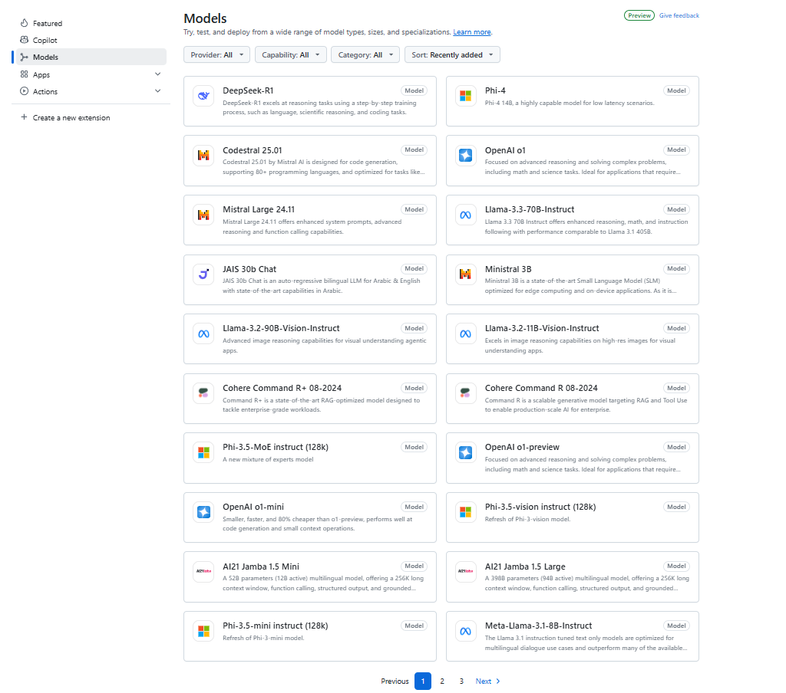
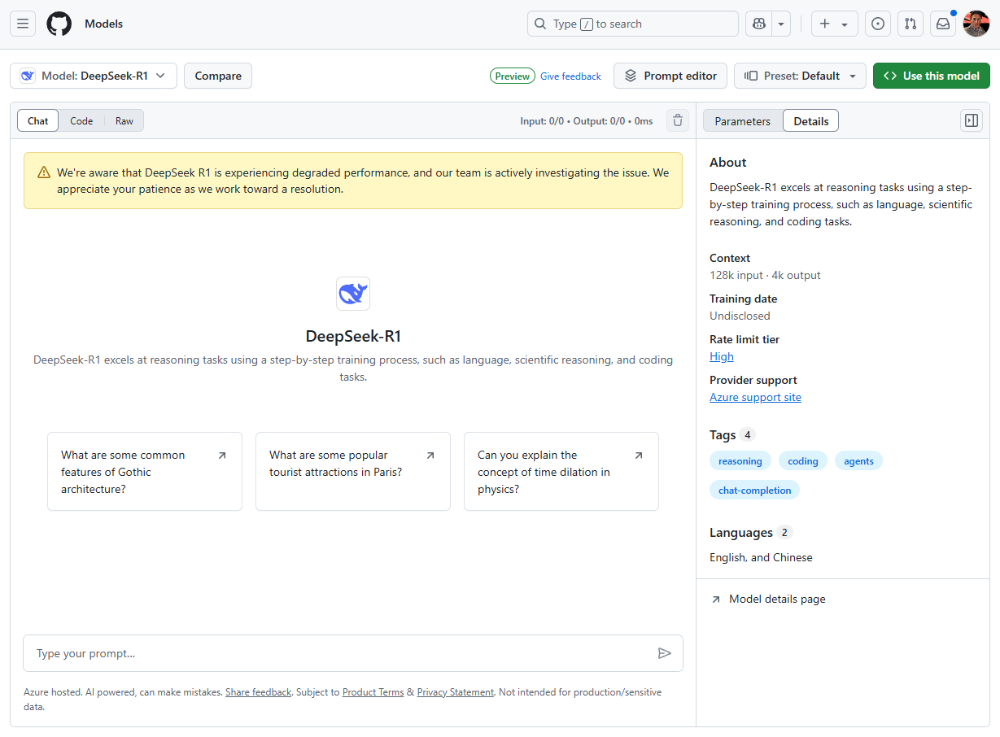
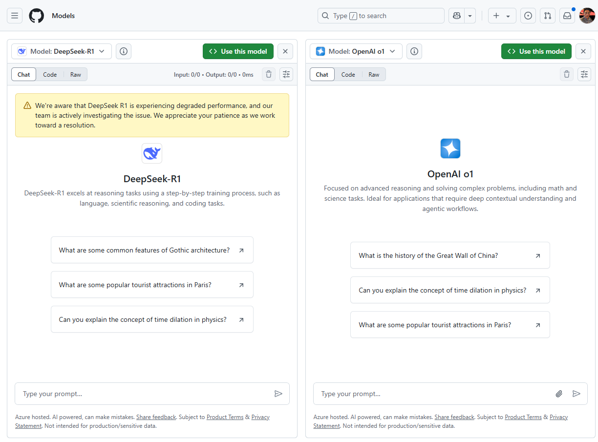

# DeepSeek-R1 and GitHub Models: A New Alternative to Hugging Face?

GitHub has entered the AI model hosting space with **[GitHub Models](https://docs.github.com/en/github-models)**, a platform that allows developers to find, experiment with, and integrate AI models directly into their workflows. The latest addition to this service is **DeepSeek-R1**, a powerful large language model (LLM) now available in **public preview**.

## What is GitHub Models?

<!-- truncate -->



If you're familiar with **[Hugging Face](https://huggingface.co/models)** (*with its vast collection of AI models, more than 1.3 million models as when this article was written*), then you'll immediately recognize the intent behind **GitHub Models**. This service enables developers to:

- **Find AI models** for various tasks (NLP, code generation, etc.).
- **Try, compare, and implement models** via a playground or API.
- **Use AI models from the command line** with **GitHub CLI** or integrate them as **Copilot extensions**.
- **Leverage a free API (currently in public preview)** to test AI capabilities.

Essentially, it's Microsoft/GitHub's answer to Hugging Face—a move that could shift where developers go for AI integrations. Although GitHub Models is still in its early stages, the addition of **DeepSeek-R1** is a significant step forward. At the time of writing this article, I counted only 22 models available in the [GitHub Models' marketplace](https://github.com/marketplace?type=models).

## Why DeepSeek-R1 Matters 🐋



DeepSeek-R1 is an advanced **large-scale AI model** designed to push the boundaries of **deep learning, NLP, and computer vision**. Here's why it's important:

1. **Massive Scale** – This model is among the most potent publicly available LLMs.
2. **Free Public Preview** – Developers can experiment with it **for free** via GitHub Models' **playground or API**.
3. **Side-by-Side Comparisons** – GitHub Models allows users to [compare DeepSeek-R1 against other models](https://github.com/marketplace/models/azureml-deepseek/DeepSeek-R1/playground?compare_to=o1).
4. **Command-Line and Copilot Integration** – You can test and implement it directly using **GitHub CLI** or within **GitHub Copilot**.
5. **Future of AI Model Hosting** – This release signals GitHub's ambition to compete with Hugging Face and **become the go-to hub for AI model distribution**.

## GitHub Models vs. Hugging Face: The Bigger Picture

### Microsoft's AI Strategy
With GitHub Models, Microsoft is expanding its **AI ecosystem**, making it easier for developers to consume LLMs without leaving GitHub. This aligns with their broader strategy:

- **Deep OpenAI Partnership** – Microsoft has invested heavily in OpenAI and is integrating AI models directly into its products.
- **GitHub Copilot** – AI-assisted coding is already integrated into GitHub; now, models like DeepSeek-R1 will enhance this further.
- **Azure AI Integration?** – It's likely that GitHub Models will eventually tie into **Azure AI**, pushing enterprise adoption.

### Hugging Face's Edge
Hugging Face has been the dominant **developer-first** AI model hub. It has:
- A **strong open-source community**.
- A **large collection of pre-trained models**.
- **Collaborative tools** for fine-tuning and deploying models.

The key battle will be **ecosystem lock-in** - GitHub has a vast user base, but Hugging Face has deep community trust.

## Getting Started with DeepSeek-R1 on GitHub Models



Want to try **DeepSeek-R1** yourself? Here's how:

- **Use the Playground** – Experiment with the model for free.
- **Try the API** – Integrate DeepSeek-R1 into your own applications.
- **Compare AI Models** – Test its performance against other models with GitHub's side-by-side comparison feature.
- **Run from CLI** – Use the **GitHub CLI** for quick testing.
- **Extend Copilot** – Integrate DeepSeek-R1 as a **Copilot extension**.

👉 [Official GitHub Documentation](https://docs.github.com/en/github-models/integrating-ai-models-into-your-development-workflow#using-ai-models-from-the-command-line)

I tested the chat section of DeepSeek-R1 with the following prompt:

:::tip

"Can you explain what Agentic AI is and how I can start integrating it with Agentico.dev (documentation: https://agentico.dev/docs?)"

:::

It was a way for me to validate the model's understanding of a complex question, and to test if my documentation is clear an enough. 😅

The response was impressive, showing the model's ability to comprehend and generate human-like text.

PLACEHOLDER: *Add video or screenshot of the chat response*

### 👨🏻‍💻 **Sample Code: Running DeepSeek-R1 in JavaScript**

To authenticate with the model you will need to generate a personal access token (PAT) in your GitHub settings. Create your PAT token by following instructions here: [Creating a personal access token](https://docs.github.com/en/authentication/keeping-your-account-and-data-secure/managing-your-personal-access-tokens).

> This is the example you can find in the GitHub Models' playground:


```javascript
/*
$ npm install @azure-rest/ai-inference @azure/core-auth @azure/core-sse
*/
import ModelClient from "@azure-rest/ai-inference";
import { AzureKeyCredential } from "@azure/core-auth";
// Your PAT token
const token = process.env["GITHUB_TOKEN"];

export async function main() {
    const client = new ModelClient(
        "https://models.inference.ai.azure.com",
        new AzureKeyCredential(token)
    );

    const response = await client.path("/chat/completions").post({
        body: {
            messages: [
                { role: "user", content: "Can you explain what Agentic AI is and how I can start integrating it with Agentico.dev (documentation: https://agentico.dev/docs?)" }
            ],
            model: "DeepSeek-R1",
            max_tokens: 2048,
        }
    });

    if (response.status !== "200") {
        throw response.body.error;
    }
    console.log(response.body.choices[0].message.content);
}

main().catch((err) => {
    console.error("The sample encountered an error:", err);
});
```


## Final Thoughts: A New AI Hub in the Making?
GitHub Models is **a significant move** in the AI model space. It gives developers a new way to **discover, compare, and integrate AI models** - right where they already code. While **Hugging Face** remains the leader in **open-source AI**, GitHub Models has the potential to disrupt the landscape, especially with **Microsoft's backing** and deep integration with **Copilot and GitHub Actions**.

Will GitHub Models become the preferred AI hub for developers? Time will tell, but the competition is heating up. 🔥

Have you tried **DeepSeek-R1** yet? Let us know your thoughts! 🚀

