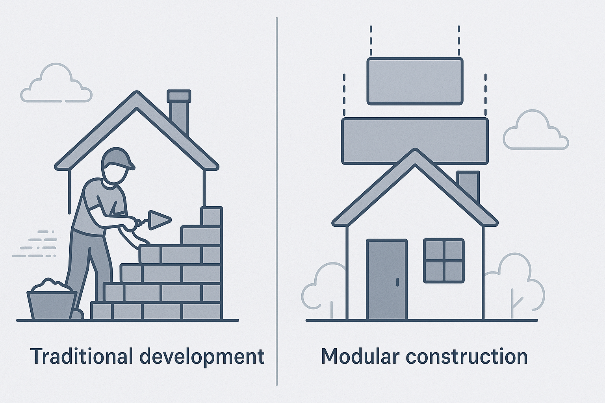

import GitHubLogo from "/img/github-logo.svg";  
import AppWindow from "/img/app-window.svg";
import MCPArchitectureDecouple from "./mcp-architecture-decouple-animated.svg";

MCP's server-first approach forces teams to declare **how** to integrate AI and tools from the beginning. This leads to fragile and high-maintenance integrations, where every new API feels like "yet another server" to configure and babysit. Our new intent-based AI for MCP flips that paradigm: you declare **what** you need ("*fetch user profile*," "*process payment*"), and the engine figures out **how** to wire up the right tools, auth, and transports automatically.  

This shift slashes integration time by up to 50%, cuts maintenance overhead by hundreds of engineering hours annually, and unlocks agile innovation—freeing teams to build products instead of maintaining servers, empowering engineers, delighting product leaders, and delivering measurable cost, time, and risk savings.

<MCPArchitectureDecouple width="80%" height="auto" style={{ margin: "0 auto", display: "block" }} />

<!-- truncate -->

---

## 🪤 The Server‑First Trap  

Traditional MCP integrations force you to treat each API as its own micro‑server: you analyze the API surface, model data, write client boilerplate, configure auth, set up transports, and stitch workflows together. For every new integration, you’re repeating this process, spinning up a fresh server and build pipeline.

* High maintenance: Each integration accumulates hundreds of lines of custom code and requires ongoing bug fixes when APIs change. Edge cases and 3rd party dependencies add complexity, making the [integration process even more cumbersome and endless](https://www.merge.dev/blog/a-guide-to-application-integration-maintenance).
* Engineering fatigue: Teams can spend 30–50% of their time on integration maintenance rather than feature work, with complex integrations costing upwards of $30K in engineering hours per project. - [API Integration cost](https://www.netguru.com/blog/api-integration-cost)
* Fragile code: Custom plumbing tends to break when upstream services evolve, leading to costly firefighting and regressions.

This "server‑first trap" creates overhead that saps momentum and frustrates both engineers and stakeholders.

* **Example:** A team spends weeks integrating a new payment processor, only to find that the API has changed, breaking their integration. They scramble to fix it, diverting resources from other critical projects.

## 🔨 Tools as the New Primitives  

The protocol's true power lies in **tools**—self‑contained actions (APIs, scripts, connectors) that an LLM can invoke at runtime. It's like USB‑C: you don't rebuild your computer to add storage; you just snap it in the device. 

Imagine traditional development as building a house brick by brick, where each brick represents a line of code. In contrast, using code generation and intent-based approaches is like assembling a house with prefabricated modules—faster, more efficient, and less error-prone.​



* Declare "what": You specify intentions like "create issue," "fetch user profile," or "process payment."
* Automated wiring: The platform infers "how" by selecting the right tool, setting up auth, and choosing transports.
* Lower overhead: No more hand‑coded connectors or brittle middleware—tools replace thousands of lines of glue code.

Thanks to MCP, modern LLMs can plug into a wide range of tools (APIs, databases, and other services); this allows them to perform complex tasks without needing to understand the underlying infrastructure. By treating tools as first-class citizens, LLMs can leverage their capabilities to enhance their performance and provide more accurate results. This tools‑first mindset accelerates development cycles and boosts collaboration across roles.

Leveraging Intent-based-AI for MCP with code generation and low-code platforms, you can automate the wiring of tools, reducing the need for custom code and allowing developers to focus on defining their intent rather than the underlying implementation details. This shift from a server-first approach to a tools-first mindset enables faster development cycles, improved collaboration, and a more efficient use of resources.

## 🤖 Meet Intent‑Based AI for MCP

Our new MCP engine flips the script: you write simple, declarative intent manifests—no custom server code.

More about this:
* [The Future of Agentic Workflows Starts with Intent](/blog/the-future-of-agentic-workflows-starts-with-Intent)
* [From API Specs to MCP Servers](/blog/from-api-specs-to-mcp-servers-and-tools)

### How it works
1. **Intent definition:** You define your intent in a simple, declarative format in manifest files (JSON  or YAML), like Terraform and other DevOps tools do for [infrastructure as code](https://www.digitalocean.com/resources/articles/infrastructure-as-a-code). This allows you to specify what you want to achieve without worrying about the underlying implementation details.
2. **Automatic wiring:** The engine figures out the right tools, auth, and transports to execute your intent. Intent-based AI automates server plumbing so devs can focus on the tool intents—just like code-gen platforms free devs from scaffolding.
3. **Declarative intent:** With this new intent‑based AI for MCP, you **declare** your intent—"I need a database read," "I need a payment processed"—and the engine selects, wires, and executes the right toolchain, producing a new MCP Server on the fly.


```yaml
# server.yaml
# for simplicity, we show only the relevant parts of the intent-based server.
# The full specification can be found in the https://intent-based.ai website and our docs.
tools:
  - name: reverse
    description: Reverses the input string
    schema:
      type: object
      properties:
        input:
          type: string
          description: The string to reverse

  - name: uppercase
    description: Converts the input string to uppercase
    schema:
      type: object
      properties:
        input:
          type: string
          description: The string to convert to uppercase
```

The entry point of the application (`index.ts`) is remarkably simple:

```typescript
#!/usr/bin/env node
import createServerFromFile from "@agentico/mcp-intent-based";

async function startServer() {
  const server = await createServerFromFile();
  // Yes, that's all you need to do to start the server with Agentico and Intent Based AI!!
  // server.yaml dictates the tools to be created
}

startServer().catch((error) => {
  console.error("Error starting server:", error);
  process.exit(1);
});
```

- **Alpha release:** Explore it now on GitHub → https://github.com/agentico-dev/mcp or in NPM registry: [Server](https://agentico.dev/docs/intent-based-mcp) and [tools examples](https://www.npmjs.com/package/@agentico/mcp-intent-based-demo).
- **Community feedback:** We welcome contributions and suggestions from the community to enhance the intent-based AI for MCP.
- **Future vision:** This is just the beginning; we envision a world where you can declare your intent and let the engine handle the rest, making integrations as easy as plugging in a USB device.

### Real‑World Validation

* [Capital One's approach to Intent-Based Engineering (IBE)](https://www.capitalone.com/tech/software-engineering/what-is-intent-based-engineering/) emphasizes the importance of declarative programming in reducing operational overhead. By allowing developers to focus on defining their intent rather than the underlying implementation details, IBE streamlines the development process and enhances productivity. 

* Prodvana reports that teams using [intent-based deployments](https://www.prodvana.io/blog/intent-based-deployments#The-Impact-of-Prodvana) experienced up to **50 times more frequent deployments**, indicating a significant boost in deployment efficiency.

These case studies underline that intent‑based approaches aren’t theoretical—they deliver measurable agility and reliability wins.

## 💼 **Business Impact First**

Intent‑based AI for MCP accelerates time‑to‑market, drives cost efficiencies, and de‑risks tool integrations, imagining a world where you can focus on your product and let the engine handle the rest. Declare features as intents; the runtime auto‑selects APIs and workflows—no custom glue code. This is a game changer for product teams, enabling faster iterations and more reliable integrations for MCP.

* **Cost Savings:** Reduced development time translates to lower labor costs.​
* **Revenue Growth:** Faster feature releases can lead to quicker monetization opportunities.​
* **Risk Mitigation:** Standardized, AI-assisted code reduces the likelihood of human errors.​

Metric | Impact
--- | ---
Time to market | 50% faster integrations with [intent-based deployments](https://www.prodvana.io/blog/intent-based-deployments) → weeks shaved off release cycles
Cost savings | Eliminates $30K+ per [integration cost](https://www.netguru.com/blog/api-integration-cost) in custom code upkeep.
Risk reduction | Standardized, AI‑driven wiring [cuts production incidents by 47%](https://www.researchgate.net/profile/Santosh-Ratna-Deepika-Addagalla/publication/390835374_Engineering_in_the_Age_of_AI_Leveraging_Copilot_for_Enhanced_Software_Development/links/67ffb3e9df0e3f544f4257c4/Engineering-in-the-Age-of-AI-Leveraging-Copilot-for-Enhanced-Software-Development.pdf).
Developer delight | Copilot‑style productivity gains let [engineers focus on value creation, not plumbing](https://github.blog/news-insights/research/research-quantifying-github-copilots-impact-on-developer-productivity-and-happiness/).

## Conclusion
The future of MCP is **tools first**.

Picture this:
> - **Servers:** Building a power plant for every new appliance.  
> - **Tools:** Plug‑and‑play extension cords—declare you need power, and the outlet does the rest.
> - **Intent-based AI:** A smart home assistant that understands your needs and automatically connects the right appliances to the power source.

Let go of the server‑first grind. Declare your intent and unleash true integration agility with MCP’s intent‑based AI.

Let us know what you think!

---

Ready to smash the status quo? **Forget about MCP servers**—the future is **tools first**.  

Explore the intent‑based AI for MCP now:  

<GitHubLogo width="20" height="20" /> https://github.com/agentico-dev/mcp  
 Package with examples: [@agentico/mcp-intent-based-demo](https://www.npmjs.com/package/@agentico/mcp-intent-based-demo)  
 https://agentico.dev  
<AppWindow width="20" height="20" /> https://app.agentico.dev  
🤖 https://intent-based.ai  


<!-- * **Example:** Imagine building a new feature that requires integrating with a third-party payment processor. Instead of simply declaring your intent to process payments, you have to set up a new server, configure the API client, handle authentication, and manage the data flow. This is not only time-consuming but also leads to a lot of boilerplate code that needs to be maintained over time.
* **Example:** A team spends weeks integrating a new payment processor, only to find that the API has changed, breaking their integration. They scramble to fix it, diverting resources from other critical projects.
* **Example:** A product manager is frustrated because the engineering team is spending more time maintaining integrations than building new features. They realize that the server-first approach is hindering their ability to innovate and respond to market demands.
* **Example:** A startup is struggling to keep up with the pace of change in their industry because their engineering team is bogged down by the complexity of managing multiple servers and integrations. They realize that they need a more efficient way to handle these integrations to stay competitive.
* **Example:** A company is facing delays in launching new features because their engineering team is spending too much time on integration maintenance. They realize that the server-first approach is slowing them down and preventing them from delivering value to their customers. -->
