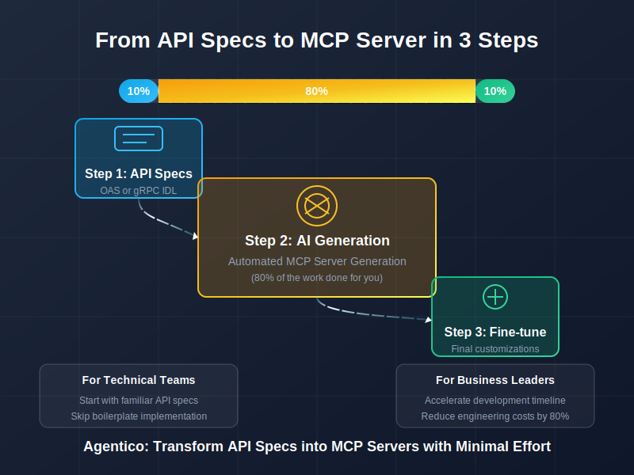
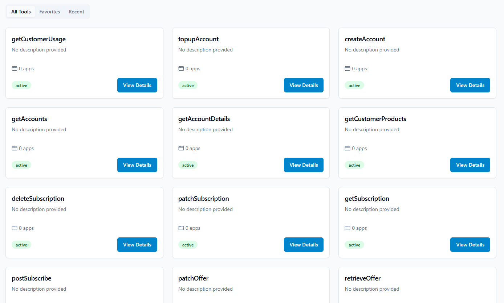

## You Might Already Have an MCP Server Without Knowing It

If you have an **[OpenAPI Specification](https://swagger.io/resources/open-api/) (OAS) or [gRPC IDL](https://grpc.io/docs/what-is-grpc/core-concepts/)**, you're closer to running an **[MCP Server](https://modelcontextprotocol.io/examples)** than you think. You've already done **10%** of the work by defining your API. But what about the rest?  

> *Agentico's workflow for transforming API specs into a fully functional MCP server.*

<!-- truncate -->

### The Challenge: Bridging the Gap Between Specs and Execution

Most API development starts with a contract; an OAS document or a gRPC IDL that defines endpoints, request/response structures, and data types. These specs are critical, but they're **not enough** to make your API fully functional within an **agentic AI system**.  

Building an **MCP (Model Context Protocol) Server** typically requires:  

- Generating code from API specs  
- Implementing business logic  
- Managing authentication and request flow  
- Ensuring compatibility with agentic AI tools  

### The 80% You Don't Have to Build

This is where **[Agentico](https://app.agentico.dev)** changes the game. Instead of manually writing boilerplate code and setting up integrations, Agentico **automatically generates** the missing 80%; turning your API specs into a fully functional MCP Server.  

What's left? Just **10% customization** to fine-tune integrations and business logic.  

### Why This Matters

Agentico **accelerates** the adoption of agentic AI by making API-driven automation seamless. Whether you're exposing LLMs, orchestrating AI workflows, or connecting services, you don't need to build from scratch anymore.  

### Get Started

You've already done the first 10%. The other 80%? **Let Agentico handle it.**

Curious? Let's talk.

Stay tuned https://go.rebelion.la/agentico-news
Contact us https://go.rebelion.la/contact-us 

Go to [Agentico App](https://app.agentico.dev) and start your journey towards a more efficient, agentic future.

Go Rebels! ✊🏽

## About Agentico

Agentico is a platform designed to simplify the development and deployment of agentic AI systems. By automating the process of turning API specifications into fully functional MCP servers, Agentico enables developers to focus on what matters most: building intelligent, responsive applications that can interact seamlessly with each other and with users.