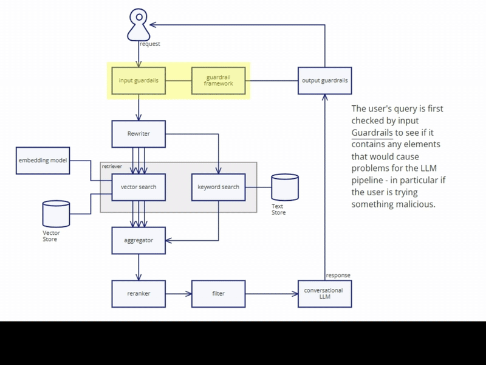

import DesignPatternsInAI from './Design-Patterns-in-AI.svg';
import AIPatternsAndTheirRoleInGenAI from './AI-Patterns-and-Their-Role-in-Generative-AI.svg';
import AIPatternsQuadrant from './AI-Patterns-quadrant.svg';
import DesignPatternsQuadrantAnalysis from './Design-Patterns-Quadrant-Analysis.svg';

# Emerging Patterns in GenAI: How to Building Next-Gen AI Products

The [GoF (Gang of Four) design patterns](https://en.wikipedia.org/wiki/Design_Patterns) were game changers in software engineering arena, same as the "[Microservices pattern language](https://microservices.io/patterns/index.html)" by Chris Richardson redefined distributed systems. Now, a new set of patterns is emerging in the world of Generative AI (GenAI), we are witnessing a similar revolution, one that is transforming AI from a proof-of-concept novelty into a reliable, production-ready tool. These patterns are not just interesting, but essential for building robust, scalable, and reliable AI products.

How can these patterns help you build smarter, more robust AI products? Let's dive in.

<!-- truncate -->

Picture this, you are building an AI product, and you don't want to repeat yourself reinventing the wheel, that is where these patterns come in. They provide a common language and set of practices that help you tame the complexities of AI-driven systems.

<DesignPatternsInAI width="90%" alt="Design Patterns in AI" />

Martin Fowler's recent article on emerging [GenAI patterns](https://martinfowler.com/articles/gen-ai-patterns/) lays out how teams can navigate the unique challenges of AI systems. At Agentico.dev, we believe that understanding these patterns isn't just interesting—it's essential. We want to explore how these patterns can help you build smarter, more robust AI products, we present you the takeaways from Martin's article, and how to choose the right pattern for your AI product, eventhough it is not an exhaustive list, it is a good starting point, and in the Martin's article, the illustrations summarizes the patterns and their relationships perfectly. We will be using this illustration as a reference in this post (See below), additionally, we will provide a guide to help you choose the right pattern for your AI product.

Let's start with the takeaways from Martin's article, and from that, we will explore how to choose the right pattern for your AI product.

## Takeaways from Martin Fowler's Article

Here are the takeaways to help you build smarter, more robust AI products.

### 1. From POC to Production: The Evolution Demands Rigor

**The shift is real.**  
Generative AI is no longer just about flashy demos or experiments. Moving from proof-of-concept to production means grappling with real-world challenges: unpredictable outputs, hallucinations, and non-deterministic behaviors. This evolution calls for the same disciplined engineering practices that built the software systems we rely on today.  
*Key insight:* Treat AI development with the same rigor as any critical system—build tests, set benchmarks, and continually monitor performance.

---

### 2. Patterns as a Compass: Guiding Design in Uncharted Territory

**Old lessons, new challenges.**  
Remember how the Gang of Four patterns and microservices architecture changed software development? In GenAI, emerging patterns are doing the same. They provide a common language and set of practices that help us tame the complexities of AI-driven systems.  
*Key insight:* Leverage these patterns to standardize your approach, reduce risk, and build more predictable, scalable AI solutions.

---

### 3. Evals: Your Quality Gate for Non-Deterministic Systems

**Not all outputs are created equal.**  
With traditional software, you can often predict what will happen. But AI systems are inherently non-deterministic—same input, different output. That's why rigorous evaluation (or "evals") is critical. Evals help you measure accuracy, relevance, and coherence across a wide range of scenarios.  
*Key insight:* Integrate systematic evaluations into your build pipeline to ensure your AI behaves as intended. Think of evals as your quality gate before any release.

---

### 4. RAG: Bridging the Gap Between Data and Context

**Bringing context to life.**  
Retrieval Augmented Generation (RAG) is more than a buzzword. It's a pattern that enhances AI by retrieving relevant information from external data sources, then using that context to improve output quality. This is especially important when working with large language models that might otherwise rely solely on static training data.  
*Key insight:* Use RAG to infuse your models with up-to-date and domain-specific information, ensuring your AI remains both accurate and contextually aware.

---

### 5. Embeddings: Simplifying Complexity with Smart Compression

**Making sense of high-dimensional data.**  
Embeddings are at the heart of many AI systems. They compress vast amounts of data—whether text, images, or other formats—into compact numerical vectors. This makes it possible to measure similarity, find patterns, and perform efficient searches.  
*Key insight:* Embrace embeddings to transform raw data into a format that's easier to work with. They're the unsung heroes that let AI understand and compare complex information quickly.

---

### 6. Guardrails: Balancing Automation with Safety

**Keep the AI in check.**  
AI's ability to generate impressive outputs comes with risks—incorrect information, biased responses, or even unsafe content. Implementing guardrails (like separate layers of validation or additional model calls) can help mitigate these risks.  
*Key insight:* Design your systems with built-in safeguards. It's not just about making AI work; it's about making it work safely and responsibly.

---

### 7. Real-World Wisdom: Learning from Hands-On Experience

**Theory meets practice.**  
Martin Fowler's insights aren't just academic—they come from real-world engagements with clients across various industries. His work reminds us that while patterns provide a framework, they're not one-size-fits-all. Context matters, and flexibility is key.  
*Key insight:* Adapt the patterns to your unique challenges. Use the lessons learned from real implementations to continuously refine and improve your approach.

---

## **AI Patterns and Their Role in GenAI**

<AIPatternsAndTheirRoleInGenAI width="90%" alt="AI Patterns and Their Role in GenAI" />

The patterns are interesting and essential for building robust, scalable, and reliable AI products. They provide a common language and set of practices that help you tame the complexities of AI-driven systems.

In an Agentic approach, we use these patterns to interact with AI models and to build AI workflows that are either deterministic or non-deterministic. We use these patterns to build AI workflows that can interact with users, other AI agents, or multiple AI models.

> <small>Source: [Martin Fowler's Article](https://martinfowler.com/articles/gen-ai-patterns/#PuttingTogetherARealisticRag)</small>

For traditional software developers embarking on their AI journey, these patterns may initially seem daunting. However, they are not vastly different from the patterns we've been using in software engineering. They are simply a new set of patterns specific to AI. To ease the transition, we've developed a quadrant to guide you in selecting the right pattern for your AI implementation.

### AI Patterns Quadrant Analysis

The quadrant, designed to **help you determine when and why** to use each AI pattern, is valuable. It strikes a balance between complexity and scope, aiding developers in deciding **which** pattern is necessary for their specific AI implementation.  

<DesignPatternsQuadrantAnalysis width="90%" alt="Design Patterns Quadrant Analysis" />

Let's take the [Model Context Protocol](https://modelcontextprotocol.io) (MCP) as an example. This robust tool allows Large Language Models (LLMs) to effortlessly interact with external data and tools. It provides a standardized schema that guarantees structured communication between AI models and their environments environment.

Assuming that you want to build a solution leveraging an [MCP compliant client](https://modelcontextprotocol.io/clients), we are going to defrief an hypothetical workflow and the integrations.

**Direct Prompting:** Starting with a single interaction with an AI model, you can use the [MCP Prompts](https://modelcontextprotocol.io/docs/concepts/prompts) which are predefined prompts that can interact with the LLM. In this case, you don't need to worry about malicious inputs, because the prompts are predefined, and the LLM is not directly exposed to the user input.

Managing user inputs is a key part of creating a safe experience, and ensuring that user intent is positive is crucial to prevent any harmful submissions that could put LLMs at risk. This is where **Guardrails** play a significant role! By implementing [execution rails](https://docs.nvidia.com/nemo/guardrails/user_guides/guardrails-process.html), you help protect the LLM from any malicious inputs, keeping everything secure. It’s also really important to have output rails in place to make sure that the results are both safe and suitable for the user and the context they’re in. 

In the implementation of our hypothetical MCP workflow, in your MCP Server you can use the Claude's guidelines to [strenghten guardrails](https://docs.anthropic.com/en/docs/test-and-evaluate/strengthen-guardrails/) and rely on [prompting the LLM](https://modelcontextprotocol.io/docs/concepts/sampling#system-prompt) to ensure that the inputs and outputs are safe; of course, *human-in-the-loop* is not the best approach for production systems, but it can be useful for prototyping or internal tools with "**advanced users in the loop**", in enterprise environments *human-in-the-loop* is the best approach to ensure that the AI is behaving as expected.

> <small>Source: [NVIDIA Guardrails](https://docs.nvidia.com/nemo/guardrails/user_guides/guardrails-process.html)</small>

Continuing with the workflow, you should retrieve information from external data sources; this is where **RAG**, **Embeddings**, and **Hybrid Retriever** come in. You can use RAG to retrieve relevant information from external data sources and then use that context to improve the output quality of the LLM. You should use **Embeddings** to transform raw data into an easier-to-work-with format. This is useful when measuring similarity, finding patterns, and performing efficient searches.

In our MCP workflow, we can use **Query Rewriting** with the [sampling](https://modelcontextprotocol.io/docs/concepts/sampling) features of the MCP protocol. This allows the MCP Server to rewrite the user query or prompt to improve the retrieval of relevant information from external data sources. This is useful when you want to improve the relevance of the information retrieved and fine tune the output of the LLM.

Below is the quadrant for determining **when and why** to use each AI pattern should balance complexity and scope, helping developers decide **which** pattern is necessary.

<AIPatternsQuadrant alt="AI Patterns Quadrant" />

---

## Wrapping Up

The journey from innovative ideas to robust, production-ready AI systems is full of twists and turns. By embracing these emerging [AI patterns](https://martinfowler.com/articles/gen-ai-patterns/), you can navigate the complexities of generative AI with a more informed, systematic approach. Agentic AI will prosper if developers leverage these patterns!

At ["La Rebelion"](https://rebelion.la), we are passionate about helping teams transform emerging technologies into reliable products. Whether you're just starting with AI or looking to refine your approach, these takeaways offer a solid foundation for your journey.

Stay innovative, stay bold, and let's build the future of AI together. Go Rebels! ✊🏼

