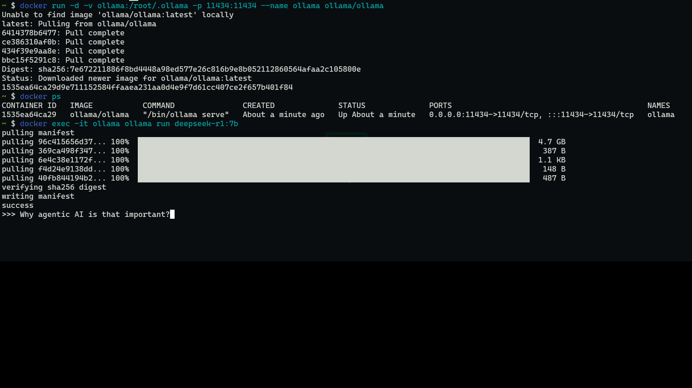

<head>
  <link rel="canonical" href="https://www.linkedin.com/pulse/run-deepseek-r1-locally-ollama-docker-adrian-escutia-wtikc" />
</head>

Would you like to run local LLMs, here is how you can do it with [Ollama](https://ollama.com/) and the new [DeepSeek](https://www.deepseek.com/)-R1 model that is breaking the boundaries of AI. 🚀

For those of us passionate about pushing the boundaries of AI, this is a game changer. 💡 

<!-- truncate -->

Being able to run powerful language models locally, with the flexibility to fine-tune and experiment in a more personalized and secure environment, opens up so many possibilities. 

## What is Ollama?

Ollama is a tool that allows you to run LLMs locally, securely, and efficiently. It is a powerful tool that allows you to run LLMs in a Docker container, and it is designed to be easy to use and flexible.

## What is DeepSeek-R1?

DeepSeek-R1 is a powerful language model that is designed to be easy to use and flexible. It is a model that is designed to be able to understand and generate human-like text, and it is trained on a large dataset of text from the internet.

## How to run DeepSeek-R1 locally with Ollama on Docker?

Steps to run [DeepSeek AI](https://github.com/deepseek-ai/DeepSeek-LLM) locally with [Ollama](https://ollama.com) on Docker:

```bash
# Install Ollama
docker run -d -v ollama:/root/.ollama -p 11434:11434 --name ollama ollama/ollama
# Pull the DeepSeek-R1 model
docker exec -it ollama ollama run deepseek-r1:7b
# Start chatting with DeepSeek-R1 - Web UI
docker run -d -p 3000:8080 --add-host=host.docker.internal:host-gateway -v open-webui:/app/backend/data --name open-webui --restart always ghcr.io/open-webui/open-webui:main
```

Open http://localhost:3000 in your browser, and you are done!

Let's make AI work for us, locally, efficiently, and creatively! 💥

## Step by step screenshots



GIF generated with [ezgic.com](https://ezgif.com/). 🎨

Go Rebels! ✊🏻